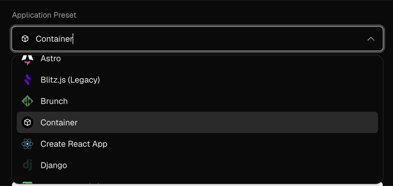

# quick-response

a go qr code generator deployed on vercel with [dockerfile.vercel](https://vercel.com/blog/dockerfile-on-vercel#:~:text=Add%20a%20Dockerfile.vercel%20file%20that%20builds%20it%20into%20a%20small%20image%20and%20runs%20it%3A).

testing the dockerfile on vercel feature:
https://vercel.com/blog/dockerfile-on-vercel

vercel auto-detects the dockerfile preset during project setup:



## endpoints

- `GET /` - web form to generate qr codes
- `GET /qr?text=hello&size=256` - returns a png
- `GET /health` - health check

## what this tests

- building a go binary inside a container on vercel
- storing and serving container images
- env vars like $port
- query params and binary responses
- cold starts and redeploys

## build log

<details>
<summary>first successful deploy output</summary>

```
19:43:16.692 Running build in Washington, D.C., USA (East) – iad1
19:43:16.699 Build machine configuration: 2 cores, 8 GB
19:43:16.867 Cloning github.com/ufraaan/quick-response (Branch: master, Commit: 2682abd)
19:43:16.868 Previous build caches not available.
19:43:17.540 Cloning completed: 673.000ms
19:43:17.935 Running "vercel build"
19:43:17.969 Vercel CLI 54.18.4
19:43:18.523   container  buildah: buildah version 1.42.2 (image-spec 1.1.1, runtime-spec 1.2.1) (storage-driver=storage.conf)
19:43:18.593   container  buildah storage: driver=overlay graphRoot=/vercel/.containers/storage runRoot=/run/containers/storage backingFs=xfs — verified
19:43:18.594   -> Authenticating to vcr.vercel.com as team_xxx
19:43:18.787   authenticated
19:43:18.788   -> Ensuring registry repository "dockerfile"
19:43:19.166   repository "dockerfile" already exists
19:43:19.167   container  Building image vcr.vercel.com/cs30/quick-response/dockerfile:2682abd7376f (buildah)
19:43:19.167     -> buildah build (linux/amd64)
19:43:19.204   container  layer store: cold (no cached images; first build or cache miss)
19:43:19.234 [1/2] STEP 1/6: FROM golang:1.24-alpine AS build
19:43:19.465 Resolved "golang" as an alias (/etc/containers/registries.conf.d/000-shortnames.conf)
19:43:19.466 Trying to pull docker.io/library/golang:1.24-alpine...
19:43:19.740 Getting image source signatures
19:43:19.741 Copying blob sha256:4f4fb700ef54461cfa02571ae0db9a0dc1e0cdb5577484a6d75e68dc38e8acc1
19:43:19.742 Copying blob sha256:8f78851c25d251496dd39ebce311b4d914a4a97c0ba1983039165a05fd96b925
19:43:19.742 Copying blob sha256:589002ba0eaed121a1dbf42f6648f29e5be55d5c8a6ee0f8eaa0285cc21ac153
19:43:19.742 Copying blob sha256:f7bdfd728ac2ad72d43b82689890dc698260d3a1049845f48fb3fb942df6c581
19:43:19.743 Copying blob sha256:c95d909b2488ff78a51d01ca745429e6d281e314006f231fe6e9f219cf5432ca
19:43:24.521 Copying config sha256:ebe4e0721205a049b6806724e1ccb05c99e334b1dc1f59e0729b31130bce3aed
19:43:24.522 Writing manifest to image destination
19:43:24.536 [1/2] STEP 2/6: WORKDIR /src
19:43:24.562 --> 503a5fda4330
19:43:24.565 [1/2] STEP 3/6: COPY go.mod go.sum ./
19:43:24.731 --> 68ee37339d9a
19:43:24.734 [1/2] STEP 4/6: RUN go mod download
19:43:25.042 --> 4497826b5c69
19:43:25.044 [1/2] STEP 5/6: COPY . .
19:43:25.203 --> e183324e9963
19:43:25.206 [1/2] STEP 6/6: RUN go build -o /server .
19:43:47.003 --> 3dc0b3e7873b
19:43:47.006 [2/2] STEP 1/4: FROM alpine:3.20
19:43:47.007 Resolved "alpine" as an alias (/etc/containers/registries.conf.d/000-shortnames.conf)
19:43:47.007 Trying to pull docker.io/library/alpine:3.20...
19:43:47.212 Getting image source signatures
19:43:47.212 Copying blob sha256:25f1d6b1951ac8eb3740558fe94cb83d377bdadf95fd9f98b50d2e1b96130471
19:43:47.421 Copying config sha256:bf8527eb54c3680e728d5b4b383a8ba730d72dae7236fbc8dff97ed6b224a731
19:43:47.422 Writing manifest to image destination
19:43:47.430 [2/2] STEP 2/4: COPY --from=build /server /server
19:43:47.639 --> 70e923fdb24a
19:43:47.642 [2/2] STEP 3/4: EXPOSE 8080
19:43:47.667 --> 1202ca9291f3
19:43:47.670 [2/2] STEP 4/4: CMD ["/server"]
19:43:47.690 [2/2] COMMIT vcr.vercel.com/cs30/quick-response/dockerfile:2682abd7376f
19:43:47.700 --> eb46bc05ff94
19:43:47.700 Successfully tagged vcr.vercel.com/cs30/quick-response/dockerfile:2682abd7376f
19:43:47.756 eb46bc05ff9470217eb4010e8beca1fe346b392e81b816aeb1991877331fdb33
19:43:47.760   built in 28.6s
19:43:47.761   -> Pushing vcr.vercel.com/cs30/quick-response/dockerfile:2682abd7376f
19:43:47.761   container  pushing vcr.vercel.com/cs30/quick-response/dockerfile:2682abd7376f with zstd compression (level=3, force, oci)
19:43:47.786 Getting image source signatures
19:43:47.786 Copying blob sha256:7ad9acd335664968870f5929f4a990bc42af55acf6817b3607e6d11326530cc2
19:43:47.787 Copying blob sha256:08bc4e534116aa76b16015484b82eac51f9a593416feae9296c8a2d4bb7aa4a2
19:43:48.921 Copying config sha256:eb46bc05ff9470217eb4010e8beca1fe346b392e81b816aeb1991877331fdb33
19:43:49.524 Writing manifest to image destination
19:43:49.722   pushed sha256:edfa421e24a8… in 2.0s
19:43:49.722   container  Image reference vcr.vercel.com/cs30/quick-response/dockerfile@sha256:edfa421e24a82cc475fbeba03e17b544fb392046b7dafaedf8c051e37cb3a843
19:43:49.733 Build Completed in /vercel/output [31s]
19:43:49.808 Deploying outputs...
19:43:58.062 Deployment completed
19:43:58.186 Creating build cache...
```
</details>
